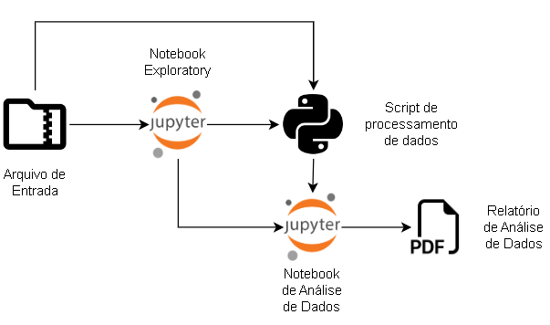

# Desafio de Dados Intellibrand

> Lucas Lukasavicus Silva
> lukasavicus at gmail dot com

## 1. Desafio:
Ficamos muito felizes com o seu interesse nesta vaga e esse teste é de grande importância para que possamos avaliar o seu conhecimento técnico, criatividade e organização no desenvolvimento da tarefa. Nosso trabalho diário é desenvolver e implementar soluções de dados que aumentam a performance dos nossos clientes nos principais sites de varejo online. Por isso, criamos este desafio técnico para simular uma atividade que é realizada pelos nossos times especialistas. Nessa tarefa, você deverá encontrar **os 10 produtos com a maior variação de preço, entre o valor encontrado no varejo online (Americanas) e o estipulado pelo fabricante**, e **os 10 produtos que apresentam maior indisponibilidade**. _Nosso cliente deseja observar com essa task se existem produtos que estão sendo vendidos com valores muito distantes do ideal_. Para isso, disponibilizamos dados coletados nos varejos em diferentes datas para que possa desenvolver essa atividade. Alguns pontos importantes sobre a estrutura dos nossos dados:

- "retailerPrice" -- é preço encontrado no varejo;
- "manufacturerPrice" -- é preço indicado pelo fabricante;
- "priceVariation" -- é a variação do preço, pode ser negativa ou positiva.
- “available” – se o produto está disponível para compra

O escopo do teste deve incluir, mas não se restringindo:
- Ingestão dos dados;
- Armazenamento dos arquivos;
- Tratamento dos dados;
- Cálculo das métricas;

Desejáveis:
- Aplicação de PyLint ou similar;
- Aplicação de Clean Code;
- Diagrama da pipeline;
- Readme;
- Coverage e Testes unitários;


Os arquivos para o teste estão em formato .zip no link;

https://drive.google.com/file/d/14nMMC19vpQ8s69TqCkQZh7SxJxlpaOzW/view?usp=sharing

Esperamos que o resultado seja entregue em um repositório GIT.
Boa sorte!
---

## 2. Desenvolvimento:
O código desenvolvido em `python3` com o uso das bibliotecas `pandas`, `zipfile`, `numpy`, `argparse` entre outras é constituído das seguintes partes:



Nesse diagrama, temos o desenvolvimento de um notebook inicial "Exploratory" usado para fazer análises inicias e verificar o schema de dados.
Nessa etapa, eu pude verificar que o schema de dados se mantinha consistente ao longo dos arquivos. Ou seja, todos os arquivos mantinham uma estrutura similar.
Para cada arquivo tinhamos os dados organizados em importantes chaves:
```
    assortment
    images
    reviews
    variants
    marketplace
```

Sendo que a chave `assortment`era a chave mais importante porque ela contém os dados de preços que busquei para fazer as análises.
No futuro, podemos usar essa informação para modelar tabelas e ligá-las através de `surrogate keys`.

Através do script `script.py` podemos transformar os dados contidos no arquivo zip em `parquet`. Esse formato é útil por comprimir os dados e mantê-los em um formato que pode ser lido através de diversas ferramentas de mercado, como pandas, pyspark entre outros.

Essa transformação de dados ocorre de forma rápida e bastante simples através da linha de comando. Um exemplo do uso desse script é:

```bash
    > python .\script.py -f "datatest.zip" -o "dataset"
```

A chamada desse script com esses parâmetros irá invocar o script passando `datatest.zip` como arquivo de entrada e produzindo um arquivo de saída chamado `dataset.parquet.gzip`.

Por fim temos o notebook de análise de dados, onde respondemos as perguntas de variação de preço e indisponibilidade dos produtos.
Além dessas perguntas investigamos também a correlação entre essas variáveis e o nome dos produtos, para avaliar por exemplo, se determinados produtos (como geladeira, por exemplo) aparecem com maior variação ou indisponibilidade.

---

## 3. Conclusão:
Através desse trabalho pude construir um simples _pipeline_ de dados para o processamento de mais de 100k registros (200Mb) que demonstrou minhas habilidades em engenharia e análise de dados.
Através da implementação em python3 seguindo padrões de _clean code_ pude entregar um projeto que permite fazer o processamento rápido e eficiente dos dados disponíveis e entregar valor ao cliente final.